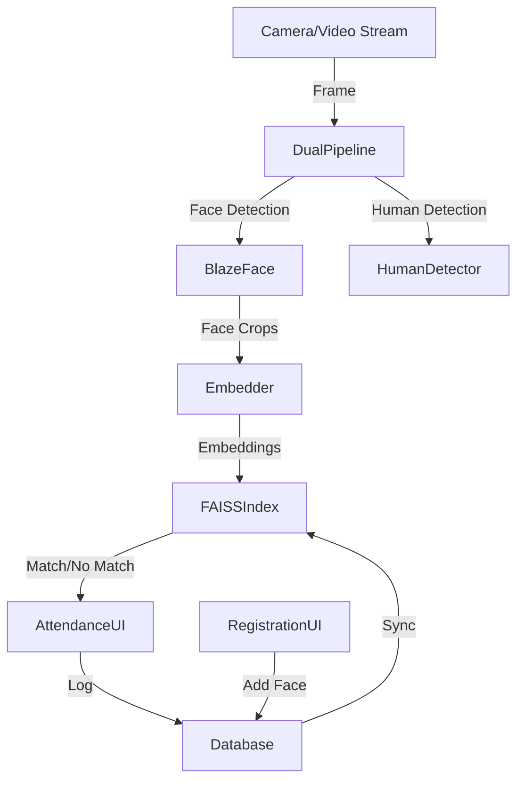
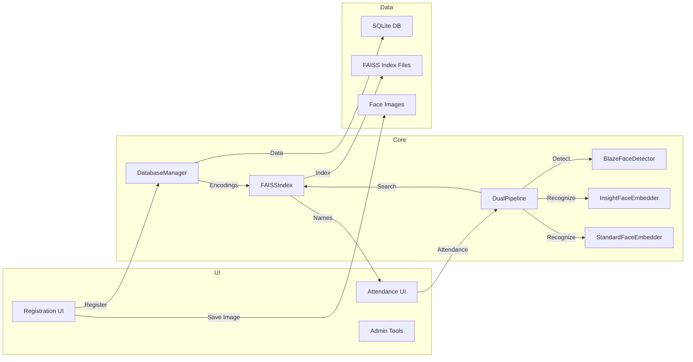
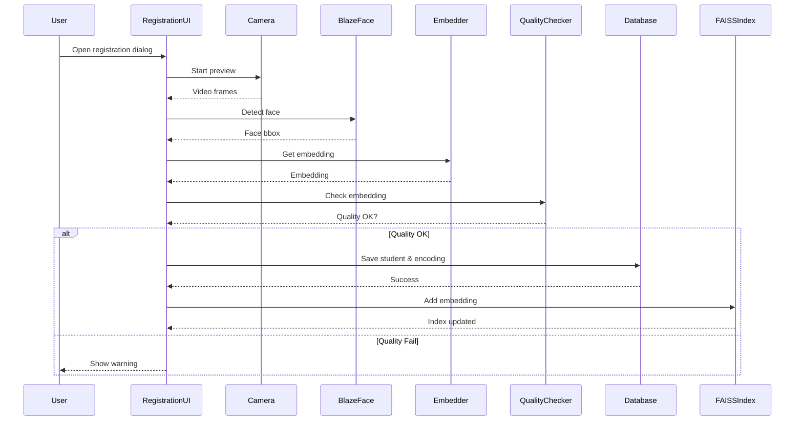
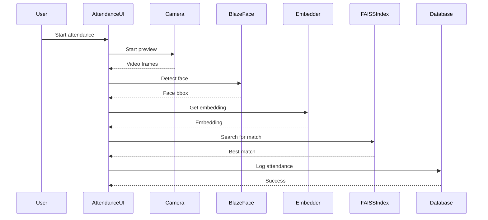

# BlazeFace-FRS System: Complete Documentation

A robust, real-time face and human recognition system with dual-pipeline architecture, modern UI, and database integration. Supports both BlazeFace (MediaPipe) and InsightFace/FaceNet embedders, with FAISS acceleration for large galleries.

---

## Table of Contents

1. [System Overview](#system-overview)
2. [Architecture & Workflow](#architecture--workflow)
3. [Folder & File Structure](#folder--file-structure)
4. [API & Module Reference](#api--module-reference)
5. [Database Schema](#database-schema)
6. [Use Case & Sequence Diagrams](#use-case--sequence-diagrams)
7. [Installation & Setup](#installation--setup)
8. [Usage Guide](#usage-guide)
9. [Troubleshooting & FAQ](#troubleshooting--faq)
10. [Dependencies](#dependencies)
11. [Version History](#version-history)
12. [License & Support](#license--support)

---

## 1. System Overview

BlazeFace-FRS is a high-performance, modular face and human recognition system. It combines:
- **BlazeFace** (MediaPipe) for fast face detection
- **InsightFace** (512-d) and **FaceNet** (128-d) for face recognition
- **MobileNet SSD** for human detection
- **FAISS** for scalable, fast nearest-neighbor search
- **Tkinter** UI for registration, attendance, and admin tools
- **SQLite** for robust, local database management

**Key Features:**
- Real-time, multi-threaded detection and recognition
- Robust registration with quality checks and user guidance
- Attendance and admin override UIs
- Configurable thresholds, embedders, and detection modes
- Modular, extensible codebase

---

## 2. Architecture & Workflow

### High-Level Workflow



### Component Diagram



---

## 3. Folder & File Structure

```
BlazeFace-FRS/
├── main.py                  # Main application entry point
├── requirements.txt         # Python dependencies
├── README.md                # Project documentation
├── run.bat                  # Windows launcher
├── app/
│   ├── __init__.py
│   ├── config.json           # App configuration
│   ├── constants.py          # System constants
│   ├── core/
│   │   ├── blazeface_detector.py      # BlazeFace face detection
│   │   ├── facenet_embedder.py        # FaceNet embeddings
│   │   ├── insightface_embedder.py    # InsightFace 512-d embeddings
│   │   ├── simple_face_embedder.py    # Simple/256-d fallback
│   │   ├── standard_face_embedder.py  # Standard/128-d fallback
│   │   ├── dual_pipeline.py           # Main detection/recognition pipeline
│   │   ├── faiss_index.py             # FAISS/hnswlib/np index wrapper
│   │   ├── database.py                # DB management
│   │   └── human_detector.py          # Human detection
│   ├── ui/
│   │   ├── enhanced_registration.py   # Registration UI
│   │   ├── attendance_marking.py      # Attendance UI
│   │   ├── admin_override.py          # Admin override UI
│   │   └── main_dashboard.py          # Main dashboard
│   └── utils/
│       ├── camera_utils.py            # Camera management
│       ├── encoding_quality_checker.py# Embedding quality checks
│       └── ...
├── scripts/                 # Migration/admin scripts
│   ├── migrate_db_to_faiss.py         # DB→FAISS migration
│   ├── check_and_fix_encodings.py     # Scan/fix encoding_type
│   ├── reencode_to_insightface.py     # Re-encode DB to 512-d
│   └── ...
├── database/                # SQLite DB files
├── face_data/               # Saved face images
├── data/                    # FAISS index files
├── models/                  # Pre-trained model files
├── assets/                  # App assets (icons, etc.)
├── logs/                    # Log files
└── ...
```

---

## 4. API & Module Reference

### Core Modules

- **blazeface_detector.py**: MediaPipe-based face detection, returns bounding boxes and confidence.
- **insightface_embedder.py**: Loads InsightFace model, provides 512-d embeddings, robust preprocessing, and detection.
- **facenet_embedder.py / standard_face_embedder.py**: FaceNet/128-d fallback embedder.
- **faiss_index.py**: Unified wrapper for FAISS, hnswlib, or numpy fallback. Supports add, search, save, load.
- **dual_pipeline.py**: Orchestrates detection, embedding, and recognition. Loads FAISS index, manages threading.
- **database.py**: Handles all DB operations (students, encodings, attendance, logs).
- **encoding_quality_checker.py**: Checks embedding norm, mean, std, and other quality metrics.

### UI Modules

- **enhanced_registration.py**: Registration dialog with live feedback, quality checks, and guidance.
- **attendance_marking.py**: Attendance UI, real-time recognition, and logging.
- **admin_override.py**: Admin tools for manual override and DB management.
- **main_dashboard.py**: Main application window and navigation.

### Utility Modules

- **camera_utils.py**: Camera enumeration, capture, and diagnostics.
- **encoding_quality_checker.py**: Embedding quality metrics and validation.

### Scripts

- **migrate_db_to_faiss.py**: Export DB encodings to FAISS index.
- **check_and_fix_encodings.py**: Scan/fix encoding_type mismatches in DB.
- **reencode_to_insightface.py**: Re-encode all DB images to InsightFace 512-d.

---

## 5. Database Schema

### students
| Column      | Type    | Description                |
|-------------|---------|----------------------------|
| id          | INTEGER | Primary key                |
| student_id  | TEXT    | Unique student identifier  |
| name        | TEXT    | Full name                  |
| email       | TEXT    | Email address              |
| phone       | TEXT    | Phone number               |
| department  | TEXT    | Department                 |
| year        | TEXT    | Year/grade                 |
| created_at  | TIMESTAMP | Creation timestamp        |
| updated_at  | TIMESTAMP | Last update timestamp     |

### face_encodings
| Column        | Type    | Description                |
|---------------|---------|----------------------------|
| id            | INTEGER | Primary key                |
| student_id    | TEXT    | Foreign key to students    |
| encoding      | BLOB    | Numpy .npy bytes (float32) |
| encoding_type | TEXT    | 'insightface', 'standard', etc. |
| created_at    | TIMESTAMP | Creation timestamp        |
| image_path    | TEXT    | Path to face image         |

### attendance
| Column        | Type    | Description                |
|---------------|---------|----------------------------|
| id            | INTEGER | Primary key                |
| student_id    | TEXT    | Foreign key to students    |
| timestamp     | TIMESTAMP | Attendance time           |
| status        | TEXT    | 'present', 'absent', etc.  |
| confidence    | REAL    | Recognition confidence     |
| notes         | TEXT    | Extra info                 |

### detection_logs
| Column        | Type    | Description                |
|---------------|---------|----------------------------|
| id            | INTEGER | Primary key                |
| event_time    | TIMESTAMP | Log time                  |
| event_type    | TEXT    | 'detection', 'error', etc. |
| details       | TEXT    | JSON/details               |

---

## 6. Use Case & Sequence Diagrams

### Use Case: Student Registration



### Use Case: Attendance Marking



---

## 7. Installation & Setup

### Prerequisites
- Python 3.8+
- Windows 10/11 (tested)
- Webcam/camera

### Setup
```bash
git clone <repo-url>
cd BlazeFace-FRS
python -m venv .venv
.venv\Scripts\activate
pip install -r requirements.txt
python main.py
```

---

## 8. Usage Guide

### Registration
1. Open the Registration UI
2. Position your face as guided (centered, well-lit)
3. Capture face; only high-quality images are accepted
4. Enter student details and register

### Attendance
1. Open Attendance UI
2. Stand in front of the camera
3. System recognizes and logs attendance if match is found

### Admin Tools
- Scan/fix encoding mismatches
- Re-encode gallery to InsightFace 512-d
- Export DB to FAISS index

### Configuration
Edit `app/config.json` for:
- Camera index, resolution
- Detection/recognition thresholds
- Model paths
- UI preferences

---

## 9. Troubleshooting & FAQ

**Q: Camera not detected?**
A: Check permissions, close other apps, try different index.

**Q: Face not recognized?**
A: Ensure good lighting, face is centered, and registration was high quality.

**Q: Quality warning on registration?**
A: The system blocks low-quality/invalid embeddings. Adjust lighting, distance, and try again.

**Q: FAISS errors or slow search?**
A: Rebuild index with `scripts/migrate_db_to_faiss.py` and ensure all encodings are the same dimension.

---

## 10. Dependencies

- OpenCV
- MediaPipe
- InsightFace
- TensorFlow
- NumPy
- Pillow
- Tkinter
- FAISS (optional, for fast search)
- hnswlib (optional, for fast search)

---

## 11. Version History

- v1.0: Initial release (BlazeFace + FaceNet)
- v1.1: InsightFace 512-d support, FAISS integration, admin tools, robust registration
- v1.2: Enhanced UI, quality checks, real-time feedback, bugfixes

---

## 12. License & Support

This project is for educational and research purposes.

For support, see documentation or open an issue in the repository.
